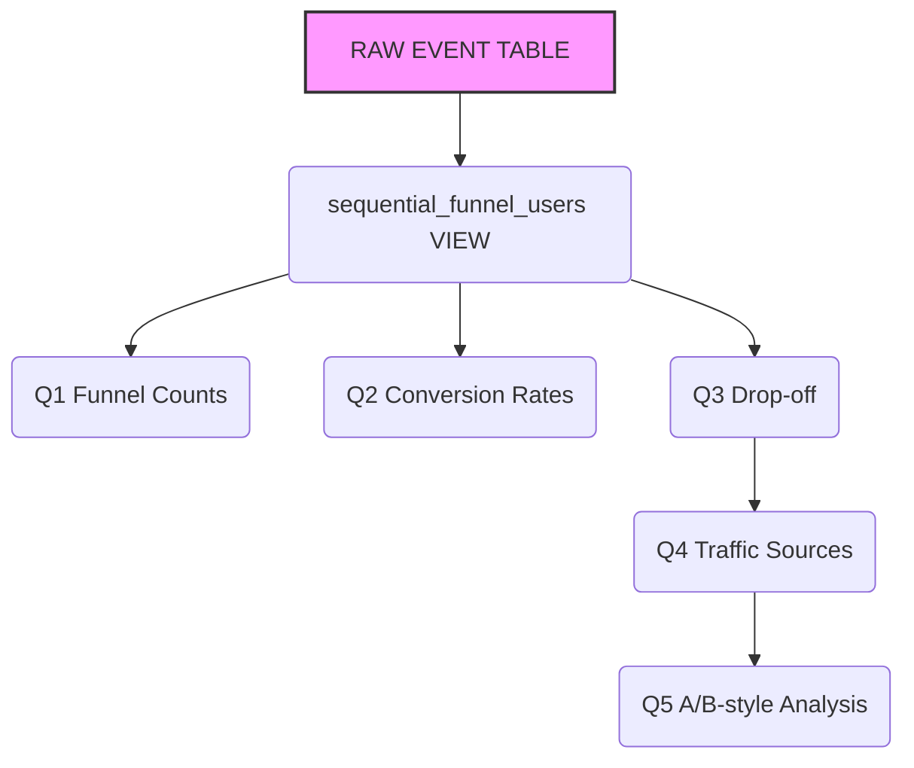

# E-Commerce-funnel-analysis
SQL-based e-commerce customer behaviour and sales funnel analysis, covering data validation, customer journey, conversion rates, drop-off analysis, and actionable business insights.
## Analytical Workflow
### RAW DATA

The raw table contains individual user events such as:

- page_view
- add_to_cart
- checkout_start
- payment_info
- purchase

Each row represents an event performed by a user.

**Goal**: Validate and understand the raw data before performing analysis.

### sequential_funnel VIEW

The raw event data is transformed into a user-level sequential funnel.

Instead of multiple event rows per user, we create a structured view where each user has a single timestamp for each funnel stage.

The sequence is validated to ensure:

Page View → Add to Cart → Checkout → Payment → Purchase

This becomes the reusable analytical layer for the rest of the project.

**Goal**: Create a reliable, user-level representation of the customer journey.

## Business Questions Structure  

- **Q1 — Funnel Size**

How many users reach each stage?

- **Q2 — Conversion Rates**

How efficiently do users move between stages?

- **Q3 — Drop-off Analysis**

Where is the biggest bottleneck?

- **Q4 — Traffic Source Analysis**

Which sources perform differently?

- **Q5 — Statistical Comparison**

Is the observed difference meaningful or potentially just noise?

