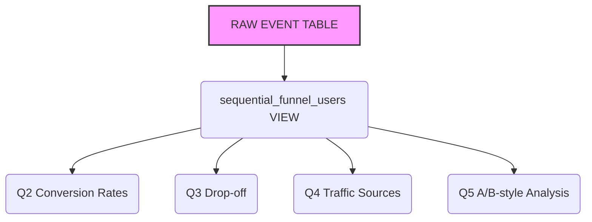

# ecommerce-funnel-analysis
SQL-based e-commerce customer behavior and sales funnel analysis, covering data validation, customer journey, conversion rates, drop-off analysis, and actionable business insights.

