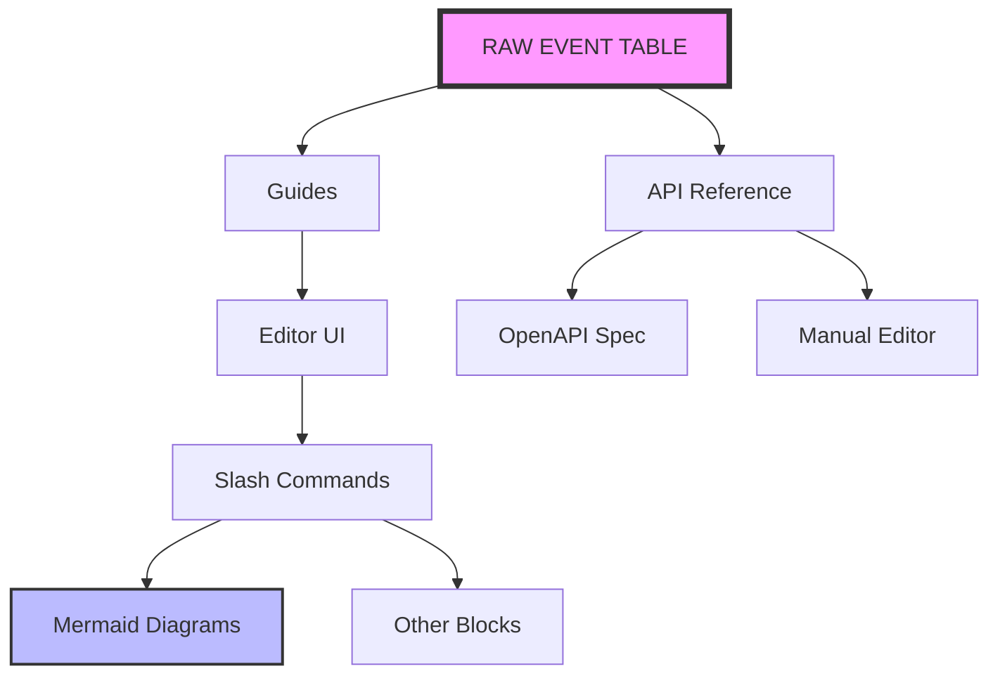

# ecommerce-funnel-analysis
SQL-based e-commerce customer behavior and sales funnel analysis, covering data validation, customer journey, conversion rates, drop-off analysis, and actionable business insights.

RAW EVENT TABLE
      │
      ▼
sequential_funnel_users VIEW
      │
      │  one row = one user
      │
      ├──────────────► Q1 Funnel Counts
      │
      ├──────────────► Q2 Conversion Rates
      │
      ├──────────────► Q3 Drop-off
      │
      ├──────────────► Q4 Traffic Sources
      │
      └──────────────► Q5 A/B-style Analysis
